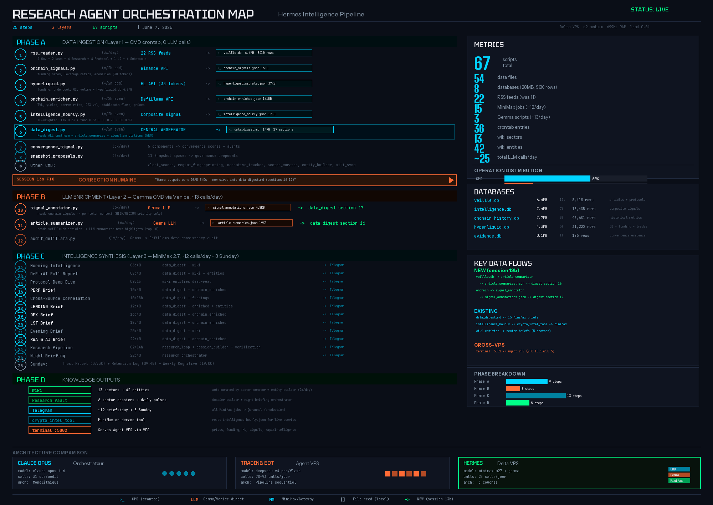

# Hermes — Autonomous Crypto Intelligence Agent

<p align="center">
  
  
  
  
  
</p>

> **Hermes** is an autonomous crypto intelligence agent running 24/7 on a dedicated GCP VPS. It ingests data from 22 RSS feeds, Binance, Hyperliquid, and DeFiLlama, computes composite signals across 33 tokens, maintains a living crypto wiki (13 sectors, 42 protocol entities), and delivers ~12 Telegram intelligence briefs per day.

> Hermes is the **intelligence layer** behind [0xDVTA](https://github.com/JohnPreston2/0xdvta) — the trading agent reads Hermes data via a crypto-terminal API served over GCP VPC internal network.

---

## Orchestration Map



---

## 3-Layer Architecture

Hermes runs a **3-layer pipeline** that separates raw data ingestion (0 LLM) from LLM enrichment and synthesis:

```
Layer 1: CMD (crontab)          Layer 2: Gemma CMD               Layer 3: MiniMax (gateway)
0 LLM calls, ~36 cron entries   ~13 LLM calls/day (Venice)       ~12 calls/day (+3 Sunday)
─────────────────────────────   ──────────────────────────────   ────────────────────────────
rss_reader (22 feeds)           signal_annotator (6x/day)        Morning Intelligence (06:40)
onchain_signals (Binance 30t)   article_summarizer (6x/day)      DeFi+AI Report (08:40)
hyperliquid (HL API 33t)        audit_defillama (1x/day)         Protocol Deep-Dive (09:15)
onchain_enricher (DeFiLlama)                                     PERP Brief (10:40)
intelligence_hourly (composite)                                  LENDING Brief (12:40)
data_digest (central aggregator)                                 DEX Brief (16:40)
convergence_signal (3x/day)                                      LST Brief (18:40)
snapshot_proposals (3x/day)                                      Evening Brief (20:40)
alert_scorer, sector_curator                                     RWA+AI Brief (22:40)
entity_builder, wiki_briefing                                    Research Pipeline (02:00)
regime_fingerprinting                                            Night Briefing (22:40)
narrative_tracker                                                + Sunday: Trust Report,
                                                                   Retention Log, Weekly
```

### Data Flow

```
SOURCES                    LAYER 1 (CMD)                  OUTPUTS                   CONSUMERS
───────                    ─────────────                  ───────                   ─────────
22 RSS feeds          ──►  rss_reader           ──►  veille.db (6.4MB)        ──►  Layer 2 + Wiki
Binance API (30 tok)  ──►  onchain_signals      ──►  onchain_signals.json     ──►  intelligence_hourly
HL API (33 tokens)    ──►  hyperliquid          ──►  hl_signals.json + hl_oi  ──►  intelligence_hourly
DeFiLlama + DexScr    ──►  onchain_enricher     ──►  onchain_enriched.json    ──►  entity_builder
All signals + DBs     ──►  intelligence_hourly  ──►  intel_hourly.json        ──►  data_digest + terminal
ALL above JSONs       ──►  data_digest (17 sec) ──►  data_digest.json         ──►  Layer 3 (MiniMax)
Wiki 5 layers         ──►  wiki_briefing        ──►  BRIEFING.md              ──►  Layer 3 (MiniMax)
```

---

## Databases

| Database | Size | Rows | Content |
|----------|------|------|---------|
| `veille.db` | 6.4 MB | 8,410 | RSS articles + protocol metadata |
| `intelligence.db` | 7.4 MB | 13,435 | Composite signals, regime fingerprints, alert outcomes |
| `onchain_history.db` | 7.7 MB | 43,681 | Historical on-chain metrics (funding, OI, z-scores) |
| `hyperliquid.db` | 4.3 MB | 31,222 | HL funding history, OI, trades |
| `evidence.db` | 0.1 MB | 186 | Convergence evidence for research |
| `state.db` | ~49 MB | — | Hermes gateway sessions (auto-purge weekly >14d) |

---

## Crypto-Terminal API (:5002)

Hermes serves a Flask API on port 5002, accessible to the trading agent via GCP VPC:

| Endpoint | Content |
|----------|---------|
| `/api/prices` | 32 tokens, 6 categories |
| `/api/funding` | 30 tokens Binance Futures |
| `/api/hyperliquid` | 33 tokens (OI, funding, orderbook, spreads) |
| `/api/signals` | Anomalies from intelligence pipeline |
| `/api/news/all` | RSS + CryptoPanic |
| `/api/intelligence` | Composite scores + tier (A/B/C) + regime per token |
| `/api/health` | Terminal health status |

### Composite Signal

The `intelligence_hourly.py` script computes an IC-weighted composite signal per token:

```
Composite = 0.33 × leverage_z + 0.34 × funding_z + 0.20 × HL_z + 0.13 × orderbook_z
```

Tokens are tiered based on signal reliability:
- **Tier A**: FET, PHB, CRV, GMX, TAO (high IC)
- **Tier B**: Most tokens (moderate IC)
- **Tier C**: BTC, WLD, SUSHI, AAVE, LDO, MKR... (low IC, noisy)

---

## Wiki — Living Knowledge Base

This repository **is** the Hermes wiki. It follows a 3-layer knowledge architecture:

### Layer 1: Knowledge (static, human-curated)
Deep research notes in `knowledge/` — protocol mechanics, competitive analysis. Updated manually via research sessions.

### Layer 2: Theses (human-written, strategic)
Investment theses in `theses/` — operator bias per sector, trading implications. Updated when market regime shifts.

### Layer 3: Live Data (auto-generated)
Auto-updated files in `live/` — entity prices, funding, TVL, regime, news count. Refreshed by `entity_builder.py` and `sector_curator.py`.

### Compilation
`BRIEFING.md` is regenerated hourly by `wiki_briefing.py` — it merges all 3 layers into a single document that MiniMax reads before generating its Telegram briefs.

### Coverage

| Type | Count | Examples |
|------|-------|---------|
| Sectors | 13 | defi-perps, defi-lending, ai-agents, ai-inference... |
| Entities | 42 | Hyperliquid, Aave, Lido, Uniswap, Bittensor... |
| Theses | 4 | AI-crypto, DeFi-lending, DeFi-perps, DeFi-RWA |
| Concepts | 2 | Restaking, Risk-on/off |
| Comparisons | 1 | Perp protocols |

---

## Infrastructure

| Component | Spec |
|-----------|------|
| **VPS** | GCP e2-medium (openclawdelta, 3.8GB RAM) |
| **Swap** | 4GB |
| **Gateway** | Hermes orchestrator (MemoryMax 512MB, 4 restarts/day) |
| **Terminal** | Flask :5002 (crypto) + :5001 (macro, partial) |
| **Stability** | health_monitor.sh per-minute (RAM/swap/load → Telegram alerts) |
| **Auto-purge** | state.db weekly (>14d), crontab staggered |

### Systemd Services
- `hermes-gateway` — MiniMax orchestrator (MemoryMax 400M, OOMPolicy=stop)
- `crypto-terminal` — Flask :5002
- `obb-terminal` — Flask :5001
- nginx, redis-server, fail2ban

---

## Connection to Trading Agent

Hermes feeds the [0xDVTA trading agent](https://github.com/JohnPreston2/0xdvta) running on a separate VPS via GCP VPC internal network (10.132.0.5:5002).

The trading agent's `load_market_context()` function reads:
- Live prices (32 tokens)
- Funding rates and anomalies
- Hyperliquid orderbook data (33 tokens)
- Composite intelligence scores + token tiers
- News headlines

If the terminal is down, the agent falls back to direct Hyperliquid API calls.

---

## LLM Budget

| Layer | Model | Calls/day |
|-------|-------|-----------|
| Gemma CMD | google-gemma-3-27b-it (Venice) | ~13 |
| MiniMax Gateway | minimax-m27 (Venice) | ~12 (+3 Sunday) |
| **Total** | | **~25 daily, ~28 Sunday** |

---

## Evolution

| Session | Date | Key Changes |
|---------|------|-------------|
| Origin | Mar 2026 | Hermes agent deployed with crypto-intelligence skill |
| s5 | May 22 | intelligence_hourly z-scores fixed, crontab staggered |
| s8 | May 25 | Market intelligence restored, alert_scorer +10pp, 37 dead jobs archived |
| s8b | May 25 | IC-weighted composite signal, /api/intelligence endpoint |
| s10 | May 29 | Gemma layer (signal_annotator + article_summarizer), MiniMax prompts patched |
| s10b | May 31 | 5 sector briefs fixed, HL 33 tokens, OI collection, observation receipts |
| s13b | Jun 7 | Entity yields, gauge vote filter, defi-infra tag, RSS 11→22, digest wiring |

---

## Repository Structure

```
hermes-wiki/
├── README.md                    # This file
├── BRIEFING.md                  # Auto-generated hourly (3-layer merge)
├── SCHEMA.md                    # Wiki schema and taxonomy rules
├── index.md                     # Content catalog
├── wiki_state.json              # Wiki metadata
├── docs/                        # Orchestration maps
├── sectors/                     # 13 sector pages (auto-curated)
├── entities/                    # 42 protocol entity pages (static)
├── live/
│   ├── entities/                # 42 auto-updated entity pages (prices, funding, TVL)
│   └── sectors/                 # 13 auto-updated sector pages
├── knowledge/                   # Deep research notes (human-curated)
├── theses/                      # Investment theses (human-written)
├── concepts/                    # Cross-sector concepts
├── comparisons/                 # Protocol comparisons
├── queries/                     # Market signal queries
├── events/                      # Monthly event logs
├── research-vault/              # Dossiers, notes, system changelog
├── crypto-surge/                # Surge detection reports (JSON + txt)
└── raw/                         # Raw source reports
```

---

## License

MIT

---

<p align="center">
  <b>Hermes — Autonomous Crypto Intelligence Agent</b><br/>
  <i>22 RSS feeds + 33 tokens + 6 databases + 3 LLM layers → living crypto intelligence</i>
</p>
